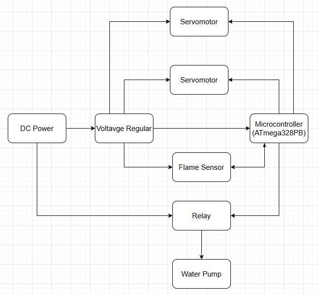

# yhcsk.github.io
5190 final project

**Team Number:** 29

**Team Name:** Three Musketeers of Upenn

| Team Member Name | Email Address         |
| ---------------- | --------------------- |
| Yishu Wang       | wang78@seas.upenn.edu |
| Shankai Chen     | skchen@seas.upenn.edu |
| Yonggeng Wu      | wuyg7@seas.upenn.edu  |

**GitHub Repository URL:** https://github.com/upenn-embedded/final-project-f25-future-lab-three-musketeers-of-upenn.git

**GitHub Pages Website URL:** [for final submission]*

## Final Project Proposal

### 1. Abstract

This project presents an **Automatic Fire Fighting System** using an  **MCU** ,  **flame sensors** , and a  **water pump mechanism** . It can automatically detect fire through infrared flame sensors, activate an alarm, and spray water toward the detected flame area. It aims to minimize human intervention during fire emergencies in small indoor spaces.

### 2. Motivation

Fire outbreaks in homes and offices cause severe property damage and loss of life each year. Conventional fire alarm systems only provide alerts without active response. The motivation of this project is to develop a **low-cost, automatic fire suppression system** that can both **detect** and **extinguish** fire immediately using accessible components.

The intended purpose is to provide an **autonomous early-response safety device** suitable for small rooms, labs, or workshops.

### 3. System Block Diagram

<<<<<<< HEAD
*Show your high level design, as done in WS1 and WS2. What are the critical components in your system? How do they communicate (I2C?, interrupts, ADC, etc.)? What power regulation do you need?*

### 4. Design Sketches

*What will your project look like? Do you have any critical design features? Will you need any special manufacturing techniques to achieve your vision, like power tools, laser cutting, or 3D printing?  Submit drawings for this section.*

### 5. Software Requirements Specification (SRS)

*Formulate key software requirements here. Think deeply on the design: What must your device do? How will you measure this during validation testing? Create 4 to 8 critical system requirements.*

*These must be testable! See the Final Project Manual Appendix for details. Refer to the table below; replace these examples with your own.*

**5.1 Definitions, Abbreviations**

**PWM:** Pulse Width Modulation — used to control servo motor rotation angle and water pump timing.

**Threshold Value:** A predefined ADC limit used to decide whether a flame is detected.

**Interrupt**: Software mechanism triggered by sensor input to perform immediate response (e.g., fire detected).

**Serial Monitor**: The serial communication interface used for debugging and data output.

**Timer**: Internal counter used for periodic sampling and timing control of fire detection and water spraying.

**5.2 Functionality**

| ID     | Description                                                                                                                                                                                                                                                                                              |
| ------ | -------------------------------------------------------------------------------------------------------------------------------------------------------------------------------------------------------------------------------------------------------------------------------------------------------- |
| SRS-01 | The**MCU——ATmega328PB** shall continuously read the flame sensor analog signal every**100 milliseconds (±10 ms)** and convert it  to a 10-bit ADC value.                                                                                                                           |
| SRS-02 | **PWM control signals**: The MCU shall send PWM control signals to the servo motors to adjust the nozzle direction toward the flame's  estimated position.                                                                                                                                   |
| SRS-03 | **Water pump spraying**: The system shall keep the water pump running for at least 5 seconds or until no flame is detected for  3  consecutive readings .                                                                                                                                   |
| SRS-04 | **Flame detection:** When the analog reading exceeds the predefined flame threshold, the MCU shall trigger a **fire detection event.** When the flame sensor reading returns below the threshold, the MCU shall deactivate the relay and stop the water pump within 1  second. |
| SRS-05 | **Servo angle control**: The system shall have the ability to adjust the servomotors to any angle thus they can detect and extinguish the fire from any direction.                                                                                                                            |
| SRS-06 | The MCU shall output all sensor readings, threshold comparisons, and pump status through the**serial monitor** for debugging  and validation.                                                                                                                                                 |

### 6. Hardware Requirements Specification (HRS)

*Formulate key hardware requirements here. Think deeply on the design: What must your device do? How will you measure this during validation testing? Create 4 to 8 critical system requirements.*

*These must be testable! See the Final Project Manual Appendix for details. Refer to the table below; replace these examples with your own.*

**6.1 Definitions, Abbreviations**

**LM2596**: DC-DC buck converter that steps down 12 V input to a stable 5 V output for logic and servo modules.

**KY-026**: Flame sensor detecting fire presence and intensity via analog voltage and digital threshold outputs.

**6.2 Functionality**

| ID     | Description                                                                                                                                                                                                             |
| ------ | ----------------------------------------------------------------------------------------------------------------------------------------------------------------------------------------------------------------------- |
| HRS-01 | The flame sensor (KY-026) shall detect fire within a range of at least**30 cm** , providing both analog intensity and digital threshold  outputs.                                                            |
| HRS-02 | The LM2596 voltage regulator shall convert a**12 V DC input** into a stable **5 V output** (±0.1 V) with a current capacity of  **≥ 2 A** ,  sufficient for powering servos and logic modules. |
| HRS-03 | Each servo motor shall rotate up to**180°** with a minimum stall torque of  **1.8 kg·cm** , used to adjust nozzle direction or mechanical  aiming.                                                   |
| HRS-04 | The relay module shall operate using a**5 V control signal** from the MCU and switch **12 V **DC** to the water pump with a load  current up to  **2 A** .**                              |
| HRS-05 | The water pump shall deliver a minimum flow rate of**1 L/min** at  **12 V DC** , sufficient to extinguish small flames within 10 seconds.                                                                   |
| HRS-06 | The 12 V DC power supply shall provide a stable output of 12 V (±0.5 V) and a continuous current of at least 2 A to support all active modules simultaneously.                                                    |

### 7. Bill of Materials (BOM)

*What major components do you need and why? Try to be as specific as possible. Your Hardware & Software Requirements Specifications should inform your component choices.*

*In addition to this written response, copy the Final Project BOM Google Sheet and fill it out with your critical components (think: processors, sensors, actuators). Include the link to your BOM in this section.*

[Final Project BOM](https://docs.google.com/spreadsheets/d/1RM9a7PHD03kyyGJe7QMgT_bWAH1gc4iGDQpE_juBU_E/edit?gid=1362749064#gid=1362749064)

### 8. Final Demo Goals

*How will you demonstrate your device on demo day? Will it be strapped to a person, mounted on a bicycle, require outdoor space? Think of any physical, temporal, and other constraints that could affect your planning.*

The device will be demonstrated  indoors , on a fire-safe testing platform. The system will be mounted on a stationary base that holds the  servo-controlled nozzle ,  flame sensors , and  water reservoir and pump assembly . First, a small controlled flame will be placed at different positions within a 30–50 cm range to the sensor. When the flame is detected by the flame sensors, the system will trigger a  buzzer and LED alarm, use the pan-tilt servos to aim the nozzle toward the detected direction and activate the pump to spray water for at least 5 s or until the flame is extinguished.Once the flame is no longer detected for 3 consecutive samples, the system automatically stops the pump and resets to standby mode.

### 9. Sprint Planning

*You've got limited time to get this project done! How will you plan your sprint milestones? How will you distribute the work within your team? Review the schedule in the final project manual for exact dates.*

| Milestone                     | Functionality Achieved                                                                                                                                                                                                                                   | Distribution of Work                                                                                                                                                                                       |
| ----------------------------- | -------------------------------------------------------------------------------------------------------------------------------------------------------------------------------------------------------------------------------------------------------- | ---------------------------------------------------------------------------------------------------------------------------------------------------------------------------------------------------------- |
| Sprint #1 (10/27~11/7)   | Basic sensor & control functionality – Flame sensor (KY-026) reading via ADC – Threshold detection and serial debug output – Buzzer + LED alert logic – Pump on/off control via relay or MOSFET                                  | A: build flame sensor + relay + pump circuit, verify power regulation (LM2596) B: write ADC + threshold detection + serial output code. C: test modules together on breadboard; document results |
| Sprint #2 (11/8~11/21)   | Servo aiming subsystem + safety logic – Dual servo pan/tilt control using PWM – Nozzle tracking simulation with LEDs – Automatic extinguish routine (spray 5 s or until no flame × 3) – Emergency stop & overcurrent protection | **A** : mount servos, design mechanical bracket. **B** : integrate PWM servo code with flame detection. **C** : run full-system test (sensing → aim → spray → stop).        |
| MVP Demo (week of 11/22) | Minimal Viable Product working end-to-end: – Detects flame, rotates nozzle, sprays water, stops when extinguished. – Manual reset and safe shutdown verified.                                                                                | **A :** ensures mechanical stability & wiring, **B :** handles firmware tuning (thresholds/timing), **C :** prepares test plan, video, and poster draft.                       |
| Final Demo (12/3~12/4)   |                                                                                                                                                                                                                                                          | **A:** finalize hardware packaging & power wiring. **B:** optimize code (debouncing, servo motion smoothing). C:                                                                     |

| **C:**lead presentation, compile final documentation, manage demo safety & logistics. |
| ------------------------------------------------------------------------------------- |

|  |
| - |

**This is the end of the Project Proposal section. The remaining sections will be filled out based on the milestone schedule.**

## Sprint Review #1

### Last week's progress

### Current state of project

### Next week's plan

## Sprint Review #2

### Last week's progress

### Current state of project

### Next week's plan

## MVP Demo

1. Show a system block diagram & explain the hardware implementation.
2. Explain your firmware implementation, including application logic and critical drivers you've written.
3. Demo your device.
4. Have you achieved some or all of your Software Requirements Specification (SRS)?

   1. Show how you collected data and the outcomes.
5. Have you achieved some or all of your Hardware Requirements Specification (HRS)?

   1. Show how you collected data and the outcomes.
6. Show off the remaining elements that will make your project whole: mechanical casework, supporting graphical user interface (GUI), web portal, etc.
7. What is the riskiest part remaining of your project?

   1. How do you plan to de-risk this?
8. What questions or help do you need from the teaching team?

## Final Project Report

Don't forget to make the GitHub pages public website!
If you’ve never made a GitHub pages website before, you can follow this webpage (though, substitute your final project repository for the GitHub username one in the quickstart guide):  [https://docs.github.com/en/pages/quickstart](https://docs.github.com/en/pages/quickstart)

### 1. Video

[Insert final project video here]

* The video must demonstrate your key functionality.
* The video must be 5 minutes or less.
* Ensure your video link is accessible to the teaching team. Unlisted YouTube videos or Google Drive uploads with SEAS account access work well.
* Points will be removed if the audio quality is poor - say, if you filmed your video in a noisy electrical engineering lab.

### 2. Images

[Insert final project images here]

*Include photos of your device from a few angles. If you have a casework, show both the exterior and interior (where the good EE bits are!).*

### 3. Results

*What were your results? Namely, what was the final solution/design to your problem?*

#### 3.1 Software Requirements Specification (SRS) Results

*Based on your quantified system performance, comment on how you achieved or fell short of your expected requirements.*

*Did your requirements change? If so, why? Failing to meet a requirement is acceptable; understanding the reason why is critical!*

*Validate at least two requirements, showing how you tested and your proof of work (videos, images, logic analyzer/oscilloscope captures, etc.).*

| ID     | Description                                                                                               | Validation Outcome                                                                          |
| ------ | --------------------------------------------------------------------------------------------------------- | ------------------------------------------------------------------------------------------- |
| SRS-01 | The IMU 3-axis acceleration will be measured with 16-bit depth every 100 milliseconds +/-10 milliseconds. | Confirmed, logged output from the MCU is saved to "validation" folder in GitHub repository. |

#### 3.2 Hardware Requirements Specification (HRS) Results

*Based on your quantified system performance, comment on how you achieved or fell short of your expected requirements.*

*Did your requirements change? If so, why? Failing to meet a requirement is acceptable; understanding the reason why is critical!*

*Validate at least two requirements, showing how you tested and your proof of work (videos, images, logic analyzer/oscilloscope captures, etc.).*

| ID     | Description                                                                                                                        | Validation Outcome                                                                                                      |
| ------ | ---------------------------------------------------------------------------------------------------------------------------------- | ----------------------------------------------------------------------------------------------------------------------- |
| HRS-01 | A distance sensor shall be used for obstacle detection. The sensor shall detect obstacles at a maximum distance of at least 10 cm. | Confirmed, sensed obstacles up to 15cm. Video in "validation" folder, shows tape measure and logged output to terminal. |
|        |                                                                                                                                    |                                                                                                                         |

### 4. Conclusion

Reflect on your project. Some questions to address:

* What did you learn from it?
* What went well?
* What accomplishments are you proud of?
* What did you learn/gain from this experience?
* Did you have to change your approach?
* What could have been done differently?
* Did you encounter obstacles that you didn’t anticipate?
* What could be a next step for this project?

## References

Fill in your references here as you work on your final project. Describe any libraries used here.
