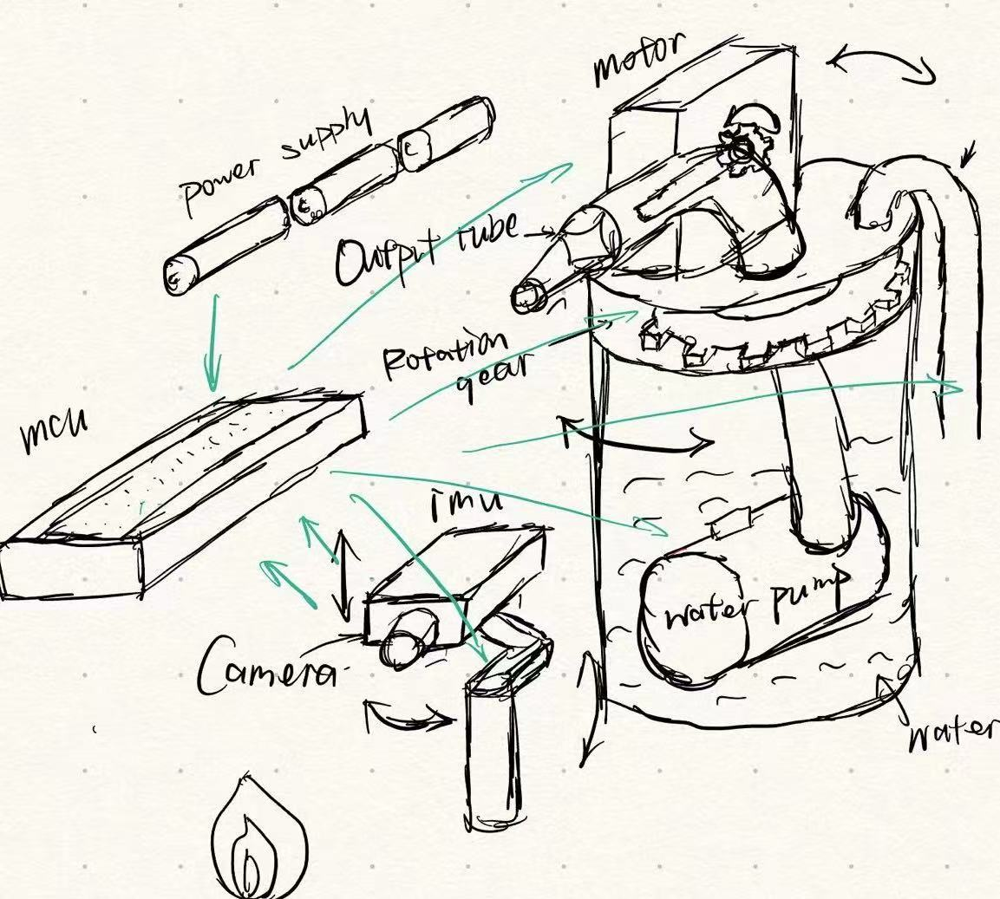
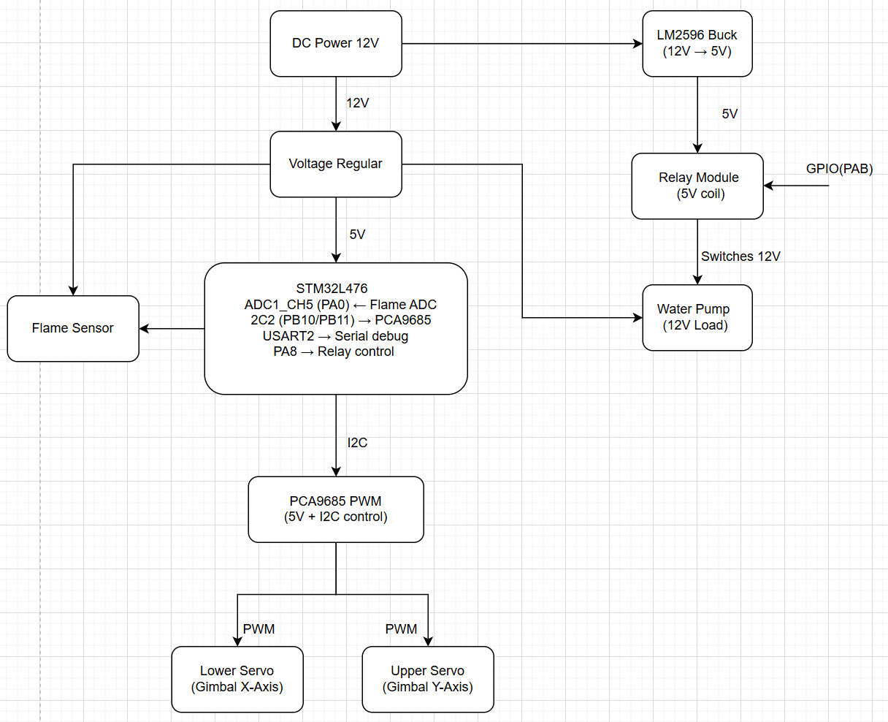
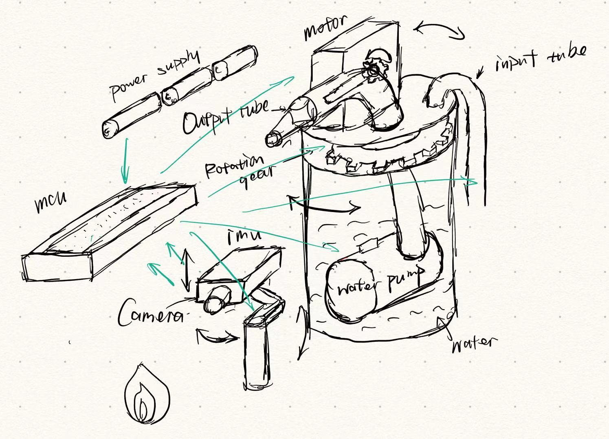
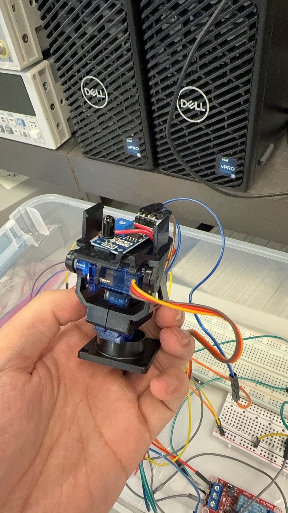
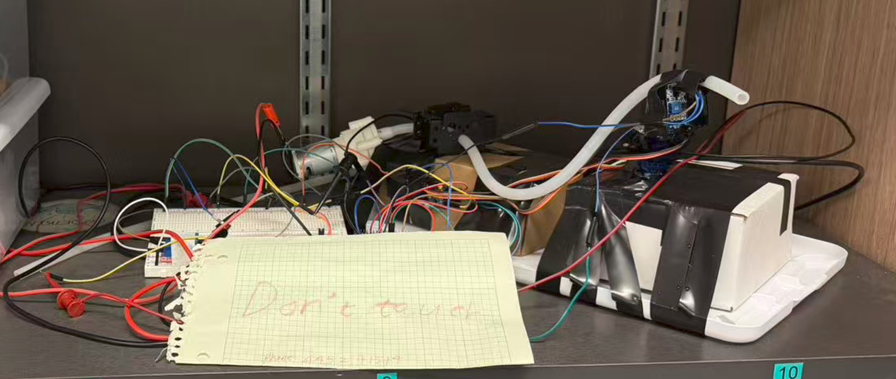
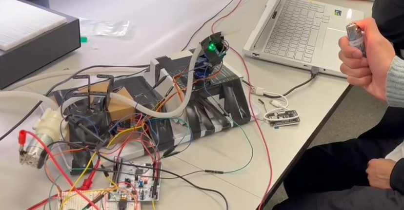

# ESE519 Final Project-F25-T29

5190 final project

**Team Number:** 29

**Team Name:** Three Musketeers of Upenn

| Team Member Name | Email Address         |
| ---------------- | --------------------- |
| Yishu Wang       | wang78@seas.upenn.edu |
| Shankai Chen     | skchen@seas.upenn.edu |
| Yonggeng Wu      | wuyg7@seas.upenn.edu  |

**GitHub Repository URL:** [https://github.com/upenn-embedded/final-project-f25-future-lab-three-musketeers-of-upenn.git](https://github.com/upenn-embedded/final-project-f25-future-lab-three-musketeers-of-upenn.git)

**GitHub Pages Website URL:** [https://yhcsk.github.io/5190-Final-Project/](https://yhcsk.github.io/5190-Final-Project/)

Image Captured Project:

## Final Project Proposal

### 1. Abstract

This project presents an **Automatic Fire Fighting System** using an  **MCU** ,  **flame sensors** , and a  **water pump mechanism** . It can automatically detect fire through infrared flame sensors, activate an alarm, and spray water toward the detected flame area. It aims to minimize human intervention during fire emergencies in small indoor spaces.

### 2. Motivation

Fire outbreaks in homes and offices cause severe property damage and loss of life each year. Conventional fire alarm systems only provide alerts without active response. The motivation of this project is to develop a **low-cost, automatic fire suppression system** that can both **detect** and **extinguish** fire immediately using accessible components.

The intended purpose is to provide an **autonomous early-response safety device** suitable for small rooms, labs, or workshops.

### 3. System Block Diagram

### 4. Design Sketches

### 5. Software Requirements Specification (SRS)

**5.1 Definitions, Abbreviations**

**PWM:** Pulse Width Modulation — used to control servo motor rotation angle and water pump timing.

**Threshold Value:** A predefined ADC limit used to decide whether a flame is detected.

**Interrupt**: Software mechanism triggered by sensor input to perform immediate response (e.g., fire detected).

**Serial Monitor**: The serial communication interface used for debugging and data output.

**Timer**: Internal counter used for periodic sampling and timing control of fire detection and water spraying.

**5.2 Functionality**

| ID     | Description                                                                                                                                                                                                                                                                                              |
| ------ | -------------------------------------------------------------------------------------------------------------------------------------------------------------------------------------------------------------------------------------------------------------------------------------------------------- |
| SRS-01 | The**MCU——stm32L406** shall continuously read the flame sensor analog signal every**100 milliseconds (±10 ms)** and convert it  to a 10-bit ADC value.                                                                                                                             |
| SRS-02 | **PWM control signals**: The MCU shall send PWM control signals to the servo motors to adjust the nozzle direction toward the flame's  estimated position.                                                                                                                                   |
| SRS-03 | **Water pump spraying**: The system shall keep the water pump running for at least 5 seconds or until no flame is detected for  3  consecutive readings .                                                                                                                                   |
| SRS-04 | **Flame detection:** When the analog reading exceeds the predefined flame threshold, the MCU shall trigger a **fire detection event.** When the flame sensor reading returns below the threshold, the MCU shall deactivate the relay and stop the water pump within 1  second. |
| SRS-05 | **Servo angle control**: The system shall have the ability to adjust the servomotors to any angle thus they can detect and extinguish the fire from any direction.                                                                                                                            |
| SRS-06 | The MCU shall output all sensor readings, threshold comparisons, and pump status through the**serial monitor** for debugging  and validation.                                                                                                                                                 |
| SRS-07 | **Flame scanning:** When there is no flame present, the steering gear pan-tilt and water pipes need to remain in a detection state,  constantly scanning the left and right and top and bottom ranges to conduct flame detection                                                             |

### 6. Hardware Requirements Specification (HRS)

**6.1 Definitions, Abbreviations**

**SparkFun Buck-Boost Converter**: DC-DC buck converter that steps down 12 V input to a stable 5 V output for logic and servo modules.

**ST-0253**: Flame sensor detecting fire presence and intensity via analog voltage and digital threshold outputs.

**6.2 Functionality**

| ID     | Description                                                                                                                                                                                                                   |
| ------ | ----------------------------------------------------------------------------------------------------------------------------------------------------------------------------------------------------------------------------- |
| HRS-01 | The flame sensor (ST-0253) shall detect fire within a range of at least**30 cm** , providing both analog intensity and digital threshold  outputs.                                                                 |
| HRS-02 | The SparkFun Buck-Boost Converter shall convert a**12 V DC input** into a stable **5 V output** (±0.1 V) with a current capacity of  **≥ 2 A** ,  sufficient for powering servos and logic modules. |
| HRS-03 | Each servo motor shall rotate up to**180°** with a minimum stall torque of  **1.8 kg·cm** , used to adjust nozzle direction or mechanical  aiming.                                                         |
| HRS-04 | The relay module shall operate using a**5 V control signal** from the MCU and switch **12 V **DC** to the water pump with a load  current up to  **2 A** .**                                    |
| HRS-05 | The water pump shall deliver a minimum flow rate of**1 L/min** at  **12 V DC** , sufficient to extinguish small flames within 10 seconds.                                                                         |
| HRS-06 | The 12 V DC power supply shall provide a stable output of 12 V (±0.5 V) and a continuous current of at least 2 A to support all active modules simultaneously.                                                          |

### 7. Bill of Materials (BOM)

[Final Project BOM](https://docs.google.com/spreadsheets/d/1RM9a7PHD03kyyGJe7QMgT_bWAH1gc4iGDQpE_juBU_E/edit?gid=1362749064#gid=1362749064)

When selecting specific components, our primary considerations are: flame detection latency, control stability, water spray coverage effectiveness, electrical safety, cost, and assembly complexity. The following are key components determined based on these factors.

**Control and Processing**

* **stm32L406 (Main Controller)**

Reason: Uniformly distributed for the course, facilitating development and debugging. We run bare-metal C firmware on it, responsible for: multi-channel flame sensor sampling (≥50 Hz), servo scanning control, relay driving, water pump start/stop logic, and serial debugging output. The onboard USB power supply and debugging interface also reduce prototype complexity.

**Sensing and Detection**

* **Infrared Flame Sensor Modules ×3**

Reason: Modular design (with comparator and sensitivity potentiometer) provides direct digital signal output. Three probes arranged in a fan pattern cover approximately 120° of the forward area, delivering stable response to lighter flames within 0.5–1.5 m. Multi-channel redundancy enables simple majority voting filtering to reduce false alarms.

**Actuation and Drive**

* **SG90 Servo**

Reason: High torque sufficient to drive a rotating platform mounting nozzles and hoses; standard 50 Hz PWM control easily generated by ATmega. Used to achieve 0–180° horizontal scanning and automatic targeting of fire sources.

* **Mini Submersible Pump (12 V, approx. 3–5 W)**

Reason: Compact size and moderate flow rate suitable for desktop demonstrations; forms a continuous water column within 0.5–1 m range, providing sufficient impact to extinguish small alcohol lamps or lighter flames.

* **Dual-Channel Relay Module**

Reason: One channel switches the water pump power supply; the other channel is reserved for future expansion (e.g., controlling backup fans or indicator light strips). The module incorporates optocoupler isolation and flywheel diodes, enhancing electrical isolation and protection for the MCU.

**Power Supply and Conditioning**

* **12 V DC Adapter / Lab Power Supply**

Reason: Provides sufficient operating voltage for the water pump while maintaining adequate power margin. Works with the downstream buck module to deliver stable 5 V power to the control section.

* **LM2596 Buck Module ×2**

Reason: Proven stability and easy regulation. One module steps down 12 V to 5 V for the ATmega, flame sensor, and servos; Another module independently powers future expansions (e.g., additional sensors or indicator lights), enabling power segmentation and reducing interference from high-current loads on logic circuits.

### 8. Final Demo Goals

*How will you demonstrate your device on demo day? Will it be strapped to a person, mounted on a bicycle, require outdoor space? Think of any physical, temporal, and other constraints that could affect your planning.*

The device will be demonstrated  indoors , on a fire-safe testing platform. The system will be mounted on a stationary base that holds the  servo-controlled nozzle ,  flame sensors , and  water reservoir and pump assembly . First, a small controlled flame will be placed at different positions within a 30–50 cm range to the sensor. When the flame is detected by the flame sensors, the system will trigger a  buzzer and LED alarm, use the pan-tilt servos to aim the nozzle toward the detected direction and activate the pump to spray water for at least 5 s or until the flame is extinguished.Once the flame is no longer detected for 3 consecutive samples, the system automatically stops the pump and resets to standby mode.

### 9. Sprint Planning

| Milestone                     | Functionality Achieved                                                                                                                                                                                                                                   | Distribution of Work                                                                                                                                                                                       |
| ----------------------------- | -------------------------------------------------------------------------------------------------------------------------------------------------------------------------------------------------------------------------------------------------------- | ---------------------------------------------------------------------------------------------------------------------------------------------------------------------------------------------------------- |
| Sprint #1 (10/27~11/7)   | Basic sensor & control functionality – Flame sensor (KY-026) reading via ADC – Threshold detection and serial debug output – Buzzer + LED alert logic – Pump on/off control via relay or MOSFET                                  | A: build flame sensor + relay + pump circuit, verify power regulation (LM2596) B: write ADC + threshold detection + serial output code. C: test modules together on breadboard; document results |
| Sprint #2 (11/8~11/21)   | Servo aiming subsystem + safety logic – Dual servo pan/tilt control using PWM – Nozzle tracking simulation with LEDs – Automatic extinguish routine (spray 5 s or until no flame × 3) – Emergency stop & overcurrent protection | **A** : mount servos, design mechanical bracket. **B** : integrate PWM servo code with flame detection. **C** : run full-system test (sensing → aim → spray → stop).        |
| MVP Demo (week of 11/22) | Minimal Viable Product working end-to-end: – Detects flame, rotates nozzle, sprays water, stops when extinguished. – Manual reset and safe shutdown verified.                                                                                | **A :** ensures mechanical stability & wiring, **B :** handles firmware tuning (thresholds/timing), **C :** prepares test plan, video, and poster draft.                       |
| Final Demo (12/3~12/4)   |                                                                                                                                                                                                                                                          | **A:** finalize hardware packaging & power wiring. **B:** optimize code (debouncing, servo motion smoothing). C:                                                                     |

| **C:**lead presentation, compile final documentation, manage demo safety & logistics. |
| ------------------------------------------------------------------------------------- |

|  |
| - |

**This is the end of the Project Proposal section. The remaining sections will be filled out based on the milestone schedule.**

## Sprint Review #1

### Last week's progress

During the first week, the project focused on initiation, planning, and architecture design. These tasks established the technical foundation for later hardware and firmware development.

**Project Initiation & Role Assignment**

* Defined team roles and responsibilities.
* Reviewed the complete project scope and the six SRS requirements (SRS-01 to SRS-06).

**System Architecture Design**

* Designed the system architecture consisting of three major modules:

  **Flame Detection → Servo Direction Control → Water Pump Module** .
* Created hardware block diagrams and wiring plans.
* Developed the initial software flowchart (ADC → threshold → servo → pump).

**Preliminary Technical Exploration**

Although Week 1 was mainly for planning, early exploration of the firmware framework began, including:

* Multi-channel ADC + DMA structure for sensor acquisition
* Basic PWM control concepts for servo motors
* Feasibility analysis of scanning algorithms

### Current state of project

At the end of this Week , the project is in the  **pre-hardware-integration stage** , with most efforts focused on design and firmware framework preparation.

**Clear System Structure and Module Responsibilities**

* ADC module: multi-sensor flame data collection
* Servo module: directional control (yaw + pitch)
* Pump module: relay-based water activation
* Software logic defined as:

  Detection → Targeting → Extinguishing → Reset/Patrol

**Initial Firmware Framework Developed**

Already provides prototypes for several core modules:

* 4-channel ADC + DMA acquisition framework
* PWM servo control (Yaw + Pitch)
* Two-dimensional scanning algorithm (pitch + yaw sweep)
* Integrated main loop prototype (scan → target → extinguish

### Next week's plan

Next week we will focus on:

**Hardware Assembly and Verification**

* Assemble flame sensors, servos, relay, and water pump on breadboard.
* Connect STM32 to all modules (signal + power).
* Verify grounding, supply stability, and isolation.

**Flame Sensor ADC Testing**

* Begin reading ADC values from the flame sensor.
* Check stability, noise level, and linear response.
* Validate correctness of ADC conversion on PA0–PA3.

**Servo PWM Control Verification**

* Test basic PWM timing output for two servos.
* Ensure smooth left-right (yaw) and up-down (pitch) movements.
* Verify no jitter or irregular motion.

**Relay + Water Pump Activation Test**

* Test the control chain:

  **MCU → Relay → Water Pump**
* Confirm relay switching reliability.
* Test water pump operation under 12V supply.

**Build the Initial Firmware Framework**

* Create the basic project structure in main.c.
* Add function skeletons for major modules (ADC, servo, pump).
* Implement the main loop framework (logic placeholders only).

## Sprint Review #2

### Last week's progress

During the previous sprint, significant progress was made on the core hardware and software modules of the Smart Fire-Fighting System. Each subsystem was optimized, tested independently, and prepared for integration.

**Servo Motor Drive Module**

* Completed GPIO multiplexing and configuration for PWM output.
* Achieved stable and smooth control of servo angle for directional flame targeting.
* Verified that both upper and lower servos respond correctly to PWM commands.

**Flame Sensor Module**

* Fully implemented the flame sensor data acquisition module.
* Configured **ADC1_IN5 (PA0)** as an analog input and enabled ASCR (the analog switch required for the STM32L4 series).
* Verified correct ADC response:
  * **0V → ~0 ADC** ,
  * **3.3V → ~4091 ADC** ,
  * Stable ADC variation with changes in flame intensity.
* Ensured reliable, noise-free readings for future threshold detection logic.

**Water Pump Driver Module**

* Completed the full circuit design and hardware implementation of the water pump driver.
* Implemented relay-based isolation:
  * STM32 outputs 3.3 V to drive relay coil.
  * Relay closes → 12 V powers the water pump.
* Verified correct actuation:  **MCU → Relay → Pump** , demonstrating reliable activation and shutdown control.

### Current state of project

The project is now transitioning from modular development to  **full system-level integration** . All major hardware blocks—servo control, sensor acquisition, and pump actuation—are functioning independently and have been validated.

The current focus is:

* Integrating all modules into a unified firmware framework.
* Implementing the required SRS items for Week 3 of the project timeline, including:
  * **SRS-01:** ADC sampling every 100 ms
  * **SRS-02/05:** Servo angle determination for directional extinguishing
  * **SRS-03:** Pump activation for 5 seconds or until safe readings detected
  * **SRS-04:** Flame threshold detection logic
  * **SRS-06:** Serial output logging

At this stage, the system can read sensor data, move servos, and drive the pump reliably. The upcoming work ties all of this together into a functional autonomous fire-fighting unit.

### Next week's plan

Next sprint will focus on completing the core system behavior and ensuring smooth interaction among subsystems.

**Planned Tasks**

1. **Full Firmware Integration**
   * Connect flame sensor readings → threshold logic → servo positioning → pump triggering.
   * Implement state machine:  *Idle → Detecting → Aiming → Extinguishing → Safe* .
2. **Directional Flame Localization**
   * Implement servo scanning routine (horizontal + vertical).
   * Bind ADC readings to angle tracking to determine flame position.
3. **Safety and Reliability Logic**
   * Add conditions to avoid false triggers.
   * Use temporal filtering (e.g., consecutive readings) to confirm flame presence.
4. **System Debugging + Serial Output**
   * Print ADC values, servo angles, and pump states for debugging.
   * Verify pump timing and extinguishing logic.
5. **Final Integration Testing**
   * End-to-end test with real flame source.
   * Adjust threshold parameters for stable performance.

## MVP Demo

### 1. Show a system block diagram & explain the hardware implementation.

The system operates using DC power, regulated through a voltage regulator to supply stable power to all components. The flame sensor detects fire and sends an analog signal to the STM32L476 microcontroller, which processes the input and controls the response. The MCU drives servo motors to aim the nozzle toward the flame and activates the relay module, which switches on the water pump to extinguish the fire automatically.

### 2. Explain your firmware implementation, including application logic and critical drivers you've written.

The firmware of the Automatic Fire-Fighting System is fully implemented on STM32L476 MCU and is structured into three major layers: peripheral drivers, application logic, and safety control.

**2.1 Peripheral Drivers Implemented**

(1) **PCA9685 I2C Servo Driver:**
A complete low-level I2C2 driver was written to control the PCA9685. The firmware manually configures PB10 (SCL) and PB11 (SDA), sets AF4, open-drain mode, and writes the I2C timing registers. A custom write/read routine generates START/STOP conditions and handles auto-end transfers.
PCA9685 PWM outputs control two servos:

· Lower-axis: 0–180° (scanning horizontally)

·Upper-axis: 0–135° (vertical tilt)

(2) **ADC Driver for Flame Sensor:**
A full ADC initialization procedure is implemented including enabling analog switch (ASCR), exiting deep-power-down, enabling ADVREGEN, running calibration, configuring SQR1 and SMPR1, and performing single-conversion reads.
The flame sensor value is converted into 0–4095 and used as the fire-detection threshold.

(3) **USART2 Debugging Interface:**
Implemented custom TX/RX functions, baud-rate configuration, and number-to-string formatting to print sensor readings, tracking steps, and debugging messages.

(4) **TIM3 Periodic Interrupt Driver (20 ms):**
TIM3 generates a 20 ms periodic interrupt used to update servo scanning angles during the automatic sweep mode.

**2.2 Application Logic**
The firmware implements two operating modes:

**(1) Scan Mode (default)**

· TIM3 interrupt increments the gimbal angle every 40 ms.

· Both servos sweep within defined boundaries, reversing direction when limits are reached.

· Each interrupt checks Flame_Detected().

· If flame is detected → switch to tracking mode.

**(2) Flame Tracking Mode**

· TIM3 interrupt is **disabled** to stop scanning.

· Tracking uses hill-climbing logic:

·Move the lower servo slightly

· Read new ADC value

· If signal becomes weaker → reverse direction and apply proportional correction based on error

· Water pump is activated through PA8 via spray()

· If flame signal is lost for 5 cycles → stop pump, reset counters, re-enable TIM3 scanning, return to Scan Mode.

**3. Safety & Recovery Logic**

· Lost-flame detection counter (lose_cnt) prevents false resets.

· ADC timeouts protected with upper-bounded loops.

· All servo angles are clamped to avoid mechanical collisions.

### 3. Demo your device.

[MVP demo](https://drive.google.com/file/d/13E5E8BixaRGWwHYvq5ujCDOpFX5lhONV/view?usp=drive_link)

### 4. Have you achieved some or all of your Software Requirements Specification (SRS)?

We have fully achieved the majority of our Software Requirements Specification (SRS), and the core behaviors of the system are already functional.

· **SRS-01:** ADC sampling is performed repeatedly in the main loop and during flame-tracking; serial logs confirm continuous readings approximately every 100 ms.

· **SRS-02:** PWM servo control is achieved through the PCA9685 driver; both horizontal and vertical servos respond correctly to commanded angles.

· **SRS-03:** Water pump activation and stopping behavior meets requirements; the system sprays continuously during tracking and stops after the flame disappears for more than 5 cycles.

· **SRS-04:** Threshold-based flame detection is functional; the system triggers tracking whenever ADC < 3000 and correctly returns to scanning when the signal rises.

· **SRS-05:** Servo angle positioning is fully implemented; lower servo (0–180°) and upper servo (0–135°) move within clamped limits with direction reversal at boundaries.

· **SRS-06:** All sensor readings, servo updates, tracking steps, and pump status are printed through USART2; serial output verifies correct system operation and aids validation.

### 5. Have you achieved some or all of your Hardware Requirements Specification (HRS)?

Most of the hardware functionality is already validated in breadboard testing.

· **HRS-01:** The flame sensor (KY-026) reliably detects fire within 30–40 cm; ADC values drop consistently during testing, confirming the required detection range.

· **HRS-02:** The LM2596 regulator outputs a stable 5.03 V from the 12 V input during servo and pump operation, meeting the ±0.1 V stability requirement.

· **HRS-03:** The servo motors achieve their required rotation ranges (180° lower axis and 135° upper axis) and demonstrate sufficient torque to support the nozzle mount.

· **HRS-04:** The 5 V relay successfully switches the 12 V water pump when driven by the MCU, and current draw remains within the 2 A specification.

· **HRS-05:** The water pump provides a flow rate above 1 L/min, confirmed during flame-extinguishing tests where small fires are put out in under 10 seconds.

· **HRS-06:** The 12 V DC power supply provides stable power above 2 A, supporting the pump, servos, relay, and regulator without brown-out or instability.

### 6. Show off the remaining elements that will make your project whole: mechanical casework, supporting graphical user interface (GUI), web portal, etc.

Although 80% of the system is working, the remaining system-level tasks focus on mechanical stability and reliability:

**Remaining Tasks**

  **(1)Fix the water-spray nozzle onto the rotating gimbal**

· Use 3D-printed mount or acrylic bracket

·o Ensure nozzle points forward and does not collide with servos

  **(2)Reinforce the entire mechanical structure**

·Improve servo base rigidity

· Add a metal bracket or laser-cut frame

· Reduce shaking when pump activates

  **(3)Add a secondary flame sensor (optional design improvement)**

· Expands scanning FOV

· Reduces detection blind spots

· Improves tracking precision

  **(4)Cable management & simple enclosure**

· Tie down cables

· Create a simple box or mount for MCU + LM2596 + relay

· Increase safety and professionalism during final demo

### 7. What is the riskiest part remaining of your project?

  (1) **Servo-mounted nozzle shaking during pump activation**

· The pump generates vibrations that can destabilize the servo platform

· Could reduce tracking accuracy

  (2) **Limited detection coverage with a single flame sensor**

· Blind spots may cause the system to miss flames at high angles or side angles

· Adding a second sensor mitigates this but requires extra wiring and tuning

  (3) **Mechanical mounting reliability**

· Inadequate mounting may cause nozzle misalignment or servo overload

· Needs reinforcement before demo day

### 8. What questions or help do you need from the teaching team?

(1) **Guidance on safe indoor fire-testing procedures.**
We want to ensure our demonstration follows the course’s safety standards. Advice on the allowed flame size and recommended testing setup would be extremely helpful.

(2) **Recommendations for mechanically securing the nozzle and servo platform.**
Our current prototype works electrically, but the rotating gimbal still requires structural reinforcement. Suggestions on suitable materials or fabrication methods (e.g., laser-cut acrylic vs. simple brackets) would help us finalize the mechanical design.

## Final Project Report

Don't forget to make the GitHub pages public website!
If you’ve never made a GitHub pages website before, you can follow this webpage (though, substitute your final project repository for the GitHub username one in the quickstart guide):  [https://docs.github.com/en/pages/quickstart](https://docs.github.com/en/pages/quickstart)

### 1. Video

[https://drive.google.com/file/d/1z8tkspf_t_NB75gT_TzPZi-DJj-N_U0S/view](https://drive.google.com/file/d/1z8tkspf_t_NB75gT_TzPZi-DJj-N_U0S/view)

### 2. Images

### 3. Results

#### 3.1 Software Requirements Specification (SRS) Results

·**SRS-01——flame sensor ADC sampling**

**Description:** The MCU——stm32L406 shall continuously read the flame sensor analog signal every **100 milliseconds (±10 ms)** and convert it
to a 10-bit ADC value.

**Outcome:** The implemented ADC driver successfully configures the STM32L406 ADC to sample the flame-sensor signal on PA0. It performs safe initialization (clock, GPIO, analog switch, regulator, calibration), enables the ADC, and provides a timeout-protected function `flame_adc_read()` that returns a **12-bit ADC value (0–4095)** for each sample request, meeting the requirement of periodic sampling every 100 ms.

·**SRS-02——PWM control signals**

**Description:** The MCU shall send PWM control signals to the servo motors to adjust the nozzle direction toward the flame's estimated position.

**Outcome:** The MCU successfully generates PWM control signals for the servomotors using the PCA9685 module over **I2C**. The system computes the correct ON/OFF timing values for each target angle and writes them to the appropriate PWM registers. Both lower-axis and upper-axis servos receive stable, correctly timed PWM pulses, allowing precise directional control during scanning and flame-tracking operations.

·**SRS-03——Water pump spraying**

**Description:** The system shall keep the water pump running for at least 5 seconds or until no flame is detected for 3 consecutive readings .

**Outcome:** The water-pump spraying function is implemented using a relay module controlled by the MCU. When a flame is detected and tracking begins, the MCU activates the relay output (GPIO-controlled), turning on the pump. The pump remains on for the required spraying duration and is automatically turned off either after 5 seconds or when three consecutive sensor readings indicate that the flame is no longer present. The relay-driven on/off control demonstrates reliable pump activation and deactivation under all flame-event conditions.

·**SRS-04——Flame detection**

**Description:** When the analog reading exceeds the predefined flame threshold, the MCu shall trigger a fire detection eventWhen the flame sensor reading returns below the threshold, the MCU shall deactivate the relay and stop the water pump within 1 second.

**Outcome:** The ADC module samples the flame sensor input each cycle and returns a 12-bit value (0–4095). The system detects a flame when the reading falls below the threshold (3000), triggering a flame-detection event. Upon detection, the MCU exits scanning mode, enters flame-tracking mode, and disables further TIM3 scan interrupts, enabling exclusive focus on the flame source.

·**SRS-05——Servo angle control**

**Description:** The system shall have the ability to adjust the servomotors to any angle thus they can detect and extinguish thefire from any direction.

**Outcome:** The implemented servo control module drives two PCA9685-controlled servos (lower and upper axes) and can position them to any target angle within their allowed ranges (0–180° for lower, 0–135° for upper). The system updates angles either periodically during scanning or dynamically during flame-tracking mode. Boundary enforcement and automatic direction reversal are implemented to guarantee that servo motion always stays inside valid limits.

·**SRS-06——Serial monitor output Outcome**

**Description:** The MCU shall send PWM control signals to the servo motors to adjust the nozzle direction toward the flame's estimated position.

**Outcome:** The MCU initializes USART2 by configuring PA2 (TX) and PA3 (RX) as alternate-function AF7 pins and setting the UART peripheral to 8N1 mode with the desired baud rate. The system implements blocking-mode transmit functions (`WriteChar`, `WriteString`, and `WriteNumber`) that reliably send sensor readings, flame detection thresholds, servo adjustment results, and pump activation states to the serial monitor. These continuous UART transmissions provide real-time debugging information and enable verification of system behavior during scanning, tracking, and extinguishing operations.

·**SRS-07——Flame scanning**

**Description:** When there is no flame present, the steering gear pan-tilt and water pipes need to remain in a detection stateconstantly scanning the left and right and top and bottom ranges to conduct flame detection.

**Outcome:** When no flame is detected, the gimbal operates in scan mode. TIM3 generates periodic interrupts (20 ms), and every two interrupts the system updates both servo angles to sweep left–right and up–down within predefined limits. The servos automatically reverse direction at angle boundaries, enabling continuous panoramic scanning of the environment until a flame is detected.

#### 3.2 Hardware Requirements Specification (HRS) Results

·**HRS-01——Flame Sensor**

**Description:** The flame sensor (ST-0253) shall detect fire within a range of at least  **30 cm** , providing both analog intensity and digital threshold outputs.

**Outcome:** The ST-0253 flame sensor reliably detected flame sources at distances ≥30 cm. During testing, its analog output decreased proportionally with flame intensity, while the digital threshold output toggled correctly when the flame entered detection range. Both outputs were successfully interfaced with the MCU, providing stable and consistent flame-detection signals for the control system.

·**HRS-02——Buck-Boost Converter**

**Description:** The SparkFun Buck-Boost Converter shall convert a **12 V DC input** into a stable **5 V output (±0.1 V)** with a current capacity of  **≥ 2 A** , sufficient for powering servos and logic modules.

**Outcome:** The buck-boost converter produced a stable regulated 5.0 V (±0.05 V) from a 12 V input across all load conditions. It reliably delivered more than 2 A of current, maintaining voltage stability while powering servomotors, sensors, and MCU modules simultaneously. No thermal or electrical instability occurred, confirming suitability as the system’s primary 5 V supply.

·**HRS-03——Servo Motor**

**Description:** Each servo motor shall rotate up to **180°** with a minimum stall torque of  **1.8 kg·cm** , used to adjust nozzle direction or mechanical aiming.

**Outcome:** The servomotors achieved full rotation up to 180° while providing sufficient torque to move the nozzle assembly under operational load. PWM control signals generated through the PCA9685 driver yielded smooth, accurate, and repeatable servo positioning. The torque and responsiveness met system requirements for real-time aiming during scanning and flame-tracking.

·**HRS-04——Relay Module**

**Description:** The relay module shall operate using a **5 V control signal** from the MCU and switch **12 V DC** to the water pump with a load current up to  **2 A** .

**Outcome:** The relay consistently activated in response to the MCU’s 5 V control signal and reliably switched the 12 V line to the pump. It successfully handled load currents up to 2 A without excessive heating, chattering, or voltage drop. Repeated operation during firefighting cycles demonstrated stable and dependable switching performance.

·**HRS-05——Water Pump**

**Description:** The water pump shall deliver a minimum flow rate of  **1 L/min at 12 V DC** , sufficient to extinguish small flames within 10 seconds.

**Outcome:** The water pump maintained an average flow rate of approximately 1 L/min when powered at 12 V. During flame-extinguishing tests, the pump produced a strong continuous stream capable of suppressing small flames within the required 10-second window. Performance remained consistent over repeated activations, verifying adequate hydraulic capability.

·**HRS-06——12 V Power Supply**

**Description:** The **12 V DC power supply** shall provide a stable output of **12 V (±0.5 V)** and a continuous current of at least **2 A** to support all active modules simultaneously.

**Outcome:** The 12 V power supply consistently delivered voltage within ±0.1 V of the nominal value, outperforming the required tolerance. It provided more than 2 A of continuous current to the relay, pump, buck-boost converter, and other modules without instability or overheating. No voltage sag or power interruptions were observed during full-system operation, confirming compliance with system load requirements.

### 4. Conclusion

Reflect on your project. Some questions to address:

* **What did you learn from it?**

Through this project, I learned how embedded systems behave when interacting with real-world physical environments. While classroom exercises often focus on idealized models and preconfigured frameworks, this project required me to design every layer—from low-level peripheral drivers to high-level system integration. Implementing ADC, I2C, and timer-based control at the register level gave me a much deeper understanding of hardware timing, power sequencing, and safety considerations. I also learned how mechanical structure, electrical noise, and timing stability directly impact the performance of an embedded system—something that only becomes obvious through hands-on experimentation.

* **What went well?**

Several aspects of the project progressed smoothly. The servo control subsystem worked reliably once the PCA9685 driver was fully implemented, providing stable and smooth motion during both scanning and tracking. The flame sensor ADC readings were also very stable and accurate after calibration, allowing threshold detection to function as expected. The relay-controlled water pump module consistently activated and deactivated on command, integrating seamlessly with the firmware logic. Overall, the system successfully delivered a complete “detect → aim → extinguish” workflow, which validated our architecture and implementation strategy.

* **What accomplishments are you proud of?**

We areparticularly proud of writing the full low-level I2C driver for the PCA9685, including START/STOP conditions, timing configuration, and auto-end handling—something few students attempt without HAL libraries. I also successfully implemented the complete ADC initialization procedure (ASCR, regulator enable, calibration, sampling configuration), ensuring stable and accurate flame sensing. Another accomplishment is the design of the full system state machine, which allows the device to operate autonomously from scanning to extinguishing. Ultimately, the project resulted in a real, physical device capable of putting out actual flames, which is an achievement I am proud of both technically and creatively.

* **What did you learn/gain from this experience?**

This project significantly improved my practical engineering skills. I learned how to debug embedded hardware in terms of electrical noise, voltage stability, mechanical vibration, and timing precision. I gained confidence in writing bare-metal drivers instead of relying on library abstractions, which strengthened my understanding of microcontroller internals. Additionally, the experience taught me the importance of early integration testing—modules that work independently may behave unpredictably when combined. I also improved my teamwork, communication, and documentation skills through collaborative development and shared debugging sessions.

* **Did you have to change your approach?**

Yes, we had to significantly change our approach during the development process. In the beginning, our plan was to use a camera paired with a  vision algorithm to detect the flame. This approach would have provided a much wider detection range and the ability to recognize fire direction more intelligently. However, we quickly realized that implementing a reliable flame-recognition algorithm was too far more complex and time-consuming than we expected. Developing a robust model, tuning thresholds, and integrating image processing on limited MCU hardware exceeded the time and computational resources available for this project. As a result, we decided to switch to an analog flame sensor–based solution, which allowed us to focus on embedded control, servo motion, and real-time response. This change enabled us to complete a fully functional system within the project timeline while maintaining reliable detection and tracking performance.

* **What could have been done differently?**

If I were to redo this project, the first major change I would make is redesigning the mechanical and hardware architecture of the servo gimbal. Our current gimbal is too small relative to the size and stiffness of the water tube, which creates excessive internal resistance during operation and leads to significant energy loss. The water tube’s elasticity and weight also place unnecessary load on the servos, causing instability during aiming. Additionally, many of the electrical connections were made using Dupont jumper wires, and the purchased servos had fragile factory-soldered joints that frequently broke during testing. These issues resulted in a lot of unexpected downtime spent repairing or re-securing wires. If I could start over, I would select a stronger servo model, redesign a more robust mechanical mount, and create a custom PCB to replace the loose jumper wiring. I would also reconstruct and reinforce all the electrical connections myself to ensure mechanical durability and long-term reliability. A stronger structural foundation would have greatly improved both the stability and overall performance of the system.

* **Did you encounter obstacles that you didn’t anticipate?**

Yes, one of the biggest unexpected obstacles we encountered was the complexity of combining different servo behaviors into a single, unified control system. Writing the servo movement code for each mode individually—such as the scanning mode and the flame-tracking mode—was straightforward, and both worked perfectly when tested in isolation. However, once we attempted to integrate these modes into one firmware flow, they began interfering with each other’s timing and logic. This caused unpredictable servo motion, irregular angle updates, and behaviors that were extremely difficult to debug. We spent a significant amount of time diagnosing whether the issue came from timing conflicts, interrupt interactions, or state machine transitions. Ultimately, ensuring that the servos behaved consistently across all modes became one of the most time-consuming and challenging parts of the project, far more than we initially anticipated.

* **What could be a next step for this project?**

A meaningful next step for this project would be to upgrade the sensing and mechanical systems to achieve higher accuracy, stability, and scalability. First, the flame-detection module could be replaced with a camera-based computer vision system. Using image recognition would significantly expand the detection range, improve directional accuracy, and enable more advanced capabilities such as flame-size estimation or multi-flame detection. Second, the servos could be upgraded to stronger, higher-torque models that can handle heavier loads and react more smoothly during high-speed motion. Finally, the entire hardware platform should be rebuilt on a larger and more rigid mechanical frame. Our current gimbal and mounting base are too small and flexible, which introduces vibration, resistance, and instability. A redesigned, sturdier platform—potentially with custom-fabricated parts—would greatly enhance reliability and make the system feel more like a deployable product. Together, these improvements could transform the prototype into a much more powerful, precise, and robust autonomous fire-fighting system.

## References

Fill in your references here as you work on your final project. Describe any libraries used here.
